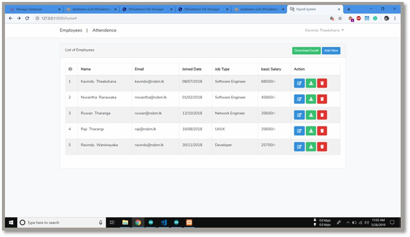
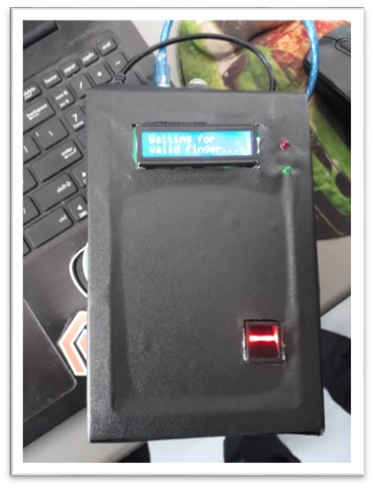

# IOT-Based-Payroll-System

Fully Automated Payroll System

 

## What are the Tools We Used to Create It 

### Softwares : Laravel PHP Framework & My SQL

### Hardwares : Fingerprint Scanner , Node MCU , LED Display , Arduino UNO

 

# API

### Data save through creating an API using Cloud Base My SQL

 

# Laravel Framework

<ul>
<li>Created Web Application using Laravel Framework.</li>
<li>Web Application can use only for the Admin.</li>
<li>Data (Such as attendance, monthly salary, working hours) of the Database can view on Web Application.</li>
<li>Pay sheet can download using Web Application.</li>
</ul>

 

# Laravel Framework

<ul>
<li>Programmed using Ardino IDE</li>
<li>Programed Using Adafruit Library</li>
<li>Making Circuit Architecture</li>
</ul>
